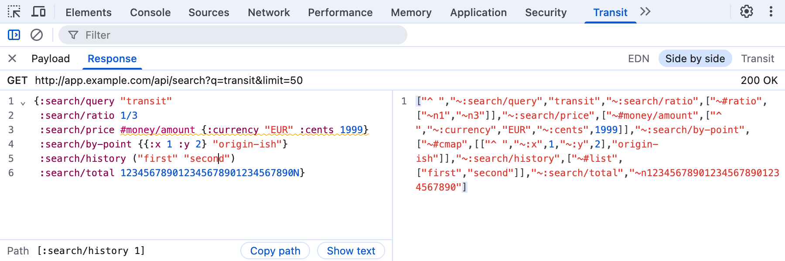

#  Transit Inspector

A **Transit** tab for Chrome and Brave DevTools, next to Network. It shows the page's [Transit](https://github.com/cognitect/transit-format) traffic decoded as readable [EDN](https://github.com/edn-format/edn), next to the raw Transit.

<picture>
  <source media="(prefers-color-scheme: dark)" srcset="docs/screenshot-dark.png">
  
</picture>

Transit packs keywords, sets, dates and non-string map keys into strings and arrays (`"~:user/id"`, `["^ ", ...]`), so the Network panel shows it as hard-to-read JSON. This panel shows the same data the way Clojure prints it.

- EDN, raw Transit, or both side by side.
- Fold, select, copy and search like in an editor.
- Double-click a bracket to select a whole form. The footer shows the `get-in` path at the cursor.
- Read a string as plain text, with real line breaks instead of `\n`, such as a stack trace.
- Follows the DevTools theme. Observe only: it never changes requests.

All features and shortcuts: [docs/guide.md](docs/guide.md).

## Install

1. Download `transit-inspector-<version>.zip` from the [latest release](https://github.com/Tuxedo-Code/transit-inspector/releases/latest) and unzip it into a folder you'll keep.
2. Open `chrome://extensions` (in Brave: `brave://extensions`) and turn on **Developer mode**.
3. Click **Load unpacked** and select the folder.
4. Open DevTools on any page. The **Transit** tab is next to Network, or under `»` if DevTools is narrow.

To update, replace the folder's contents, click reload on the extension's card, then reopen DevTools. Other Chromium browsers likely work but aren't tested; Firefox and Safari aren't supported. To build it yourself, see [CONTRIBUTING.md](CONTRIBUTING.md).

## Privacy

Captured traffic never leaves DevTools. The extension makes no network requests, has no telemetry and requests no permissions, and its Content Security Policy blocks every connection. CI checks this inside real DevTools. Details, and why Chrome still shows a "Read and change all your data" warning: [PRIVACY.md](PRIVACY.md). Verifying releases and reporting a vulnerability: [SECURITY.md](SECURITY.md).

## Limitations

- Only requests made while DevTools is open for that tab.
- Only Fetch/XHR. No WebSockets.
- Only Transit JSON. `transit+msgpack` is listed but not decoded.

Full list: [docs/guide.md](docs/guide.md#limitations).

## Contributing

Issues and pull requests are welcome: see [CONTRIBUTING.md](CONTRIBUTING.md).

## License

[MIT](LICENSE). The built extension includes third-party code under its own licenses, listed in `THIRD_PARTY_LICENSES.md` in `dist/` and in the zip.
