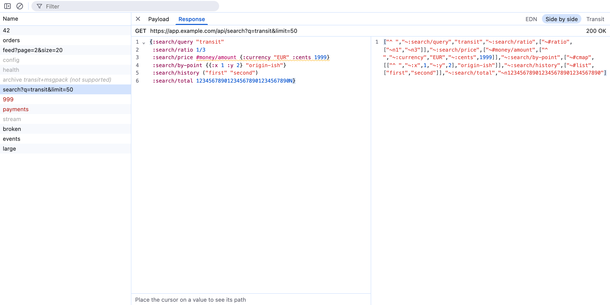

# Transit Inspector

[](https://github.com/Tuxedo-Code/transit-inspector/actions/workflows/ci.yml)

A DevTools extension for Chrome and Brave that adds a **Transit** tab next to Network. It lists the page's Fetch/XHR requests and shows [Transit](https://github.com/cognitect/transit-format) request payloads and response bodies decoded as readable [EDN](https://github.com/edn-format/edn), next to the raw Transit.

Transit is a format by Cognitect for sending data between applications, most often Clojure and ClojureScript ones. It is usually encoded as JSON, but values like keywords, sets, dates and maps with non-string keys are packed into strings and arrays (`"~:user/id"`, `["^ ", ...]`), which makes the raw JSON in the Network panel hard to read. This extension shows it as EDN, Clojure's own data notation.

- Requests carrying Transit are clickable; other Fetch/XHR requests are grayed out. Transit is detected by content type, or by sniffing bodies served as `application/json`.
- Views: EDN, Transit, or both side by side. Fold, select, copy and search (Cmd+F) like in an editor.
- The footer under the EDN view shows the `get-in` path of the value at the cursor, with a Copy button.
- Drag the border between the request list and the detail view to resize them, like in the Network panel. The width is remembered.
- Follows the DevTools light/dark theme. Observe only: it never changes requests.



## Privacy and security

The panel sees the requests and responses of the page you inspect, which often hold private data. It is built so that this data never leaves DevTools.

- **No network access, no tracking.** The extension makes no requests of its own: no telemetry, analytics, crash reports or third-party services. Captured traffic stays in DevTools' memory and is gone when you close DevTools. The only things saved are your view mode and the request list's width.
- **Enforced, not just promised.** The extension's [Content Security Policy](manifest.json) blocks every connection from its pages (`connect-src 'none'`). To check a release yourself, open `manifest.json` in the zip. CI proves inside real DevTools that nothing the panel sends reaches a server, and the build refuses APIs that could get data out some other way.
- **No permissions requested.** The manifest asks for none. Chrome still shows "Read and change all your data on all websites" on the extension's details page: it says that about every DevTools extension, because DevTools extensions *can* run code in the page they inspect. Transit Inspector never does, and its build fails if that API (`chrome.devtools.inspectedWindow.eval`) shows up in the code.
- **Dependencies** are updated monthly by Dependabot, merged by hand after CI, and audited in CI for known vulnerabilities and registry signatures. Install scripts of npm packages don't run.
- **Verifiable releases.** Each release zip is built by CI and carries a signed build attestation. Check that a download came from this repository with [`gh attestation verify`](https://cli.github.com/manual/gh_attestation_verify):

  ```sh
  gh attestation verify transit-inspector-<version>.zip -R Tuxedo-Code/transit-inspector
  ```

- **Found a problem?** Please report it privately, as described in [SECURITY.md](SECURITY.md).

Details and the reasoning behind each measure: [docs/spec.md "Privacy"](docs/spec.md#privacy) and ["Dependencies and supply chain"](docs/spec.md#dependencies-and-supply-chain).

## Install as an extension

1. Download `transit-inspector-<version>.zip` from the [latest release](https://github.com/Tuxedo-Code/transit-inspector/releases/latest) and unzip it into a folder you'll keep.
2. Open `chrome://extensions` (in Brave: `brave://extensions`) and turn on **Developer mode** (top right).
3. Click **Load unpacked** and select the unzipped folder.
4. Open DevTools on any page; the **Transit** tab is next to Network (or under `»` if DevTools is narrow).

To update: replace the folder's contents with the newer release, click the reload icon on the extension's card in the extensions page, then close and reopen DevTools.

Other Chromium browsers (Edge, Vivaldi, Opera, Arc) will likely work the same way but aren't tested. Firefox and Safari aren't supported.

### Build from source

Requires [mise](https://mise.jdx.dev) (or Node 24).

```sh
git clone https://github.com/Tuxedo-Code/transit-inspector.git
cd transit-inspector
mise install
npm ci
npm run build
```

Then load the `dist/` folder with **Load unpacked** as above. After pulling changes, run `npm run build` again and reload the extension. `npm run package` creates the same `transit-inspector-<version>.zip` that releases ship.

## Limitations

**What gets captured**

- Only requests made while DevTools is open for that tab. Requests from before DevTools was opened are never seen. Requests made before you click the Transit tab are fine.
- Only Fetch/XHR requests. WebSocket messages, documents, scripts and other resource types are not shown.
- A page reload clears the list, like the Network panel. SPA route changes don't. There is no "Preserve log" yet.
- At most the last 1,000 requests are kept; older ones drop off.
- Requests started in the same millisecond can briefly appear in the order they finished instead of the order they started, right after a reload.

**What gets decoded**

- Only Transit JSON. `application/transit+msgpack` requests are listed but grayed out and not decoded.
- Transit served with another content type is only detected if the first 4 KB of the body contain a Transit marker (`"^ "`, `"~:` or `"~#`). A body without any keywords, tags or maps, such as a plain array of numbers, is treated as plain JSON.
- Bodies of requests without Transit aren't kept, so plain JSON responses can't be opened here. Use the Network panel for them.
- If DevTools has already discarded a response body, the panel says it's no longer available.
- Observe only: requests can't be paused, edited, replayed or overridden.

**How values are shown**

- A float sent as `1.0` shows as `1`: JSON doesn't distinguish them, so the information is gone before decoding.
- Integers above 2^53 are exact when sent the Transit way (`"~i..."`). If a server sends them as plain JSON numbers, they may already have lost precision; such values are underlined with a warning.
- Map entries and set elements are shown in the order they were sent, not in Clojure's own (hash) order.
- App-specific Transit tags have no handlers here: they show as `#tag value` with a warning underline. URIs show as `#uri "..."`, which standard EDN readers don't know.
- Paths in the footer use list positions too, but `get-in` can't index into lists, so such a path won't work as-is in Clojure.
- The URL filter is a plain case-insensitive substring match: no wildcards or regular expressions.
- Bodies are decoded when you open them. A 3 MB response takes about 100 ms; much larger ones may briefly freeze the panel.

## Run locally (development)

- `npm run dev`: opens the panel UI in a normal browser tab with sample data (`samples/basic.har`) and hot reload.
- `npm run dev:ext`: rebuilds `dist/` on every change. Reload the extension and reopen DevTools to see changes.
- `npm test`: unit tests. `npm run test:e2e`: browser tests, including the extension in real DevTools (opens a Chrome window).
- `npm run lint`: lint and format check.

Design and decisions: [docs/spec.md](docs/spec.md). Work plan: [docs/tasks.md](docs/tasks.md).

## Contributing

Issues and pull requests are welcome. Please read [docs/spec.md](docs/spec.md) first: its non-goals are binding, so features that change or replay requests are out of scope. Before opening a pull request, run `npm run lint`, `npm test` and `npm run test:e2e`; CI runs the same checks.

Commit messages (or squash-merge titles) follow [Conventional Commits](https://www.conventionalcommits.org): `feat:` and `fix:` end up in the changelog and trigger a release. Releases are automated with release-please: pushes to `main` keep a release PR open, and merging it publishes a GitHub Release with the changelog and the zip. See "Releases" in [docs/spec.md](docs/spec.md).

## License

[MIT](LICENSE). The built extension includes third-party code under its own licenses, listed in `THIRD_PARTY_LICENSES.md` in `dist/` and in the zip.
